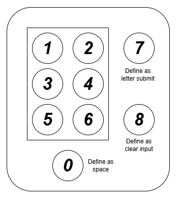
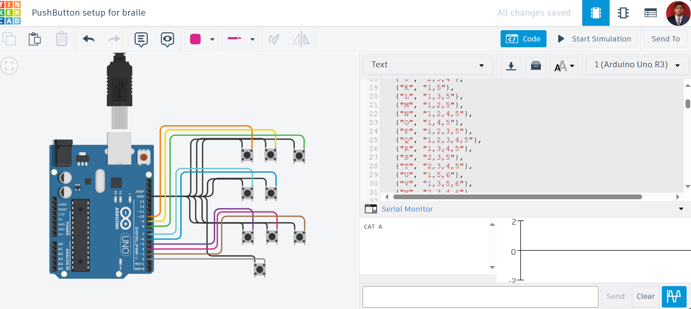

# Arduino Braile-to-text
## Overview
The Arduino Braille-to-Text project is designed to convert Braille alphabet input into readable text, enabling better communication for people who are both blind and mute. This project allows users to input Braille characters using push buttons, and these characters will be displayed in real-time on a screen, providing a live-chat-like experience.

This solution offers a significant step forward in accessible communication, making it easier for individuals with visual impairments to engage with others through written text.

## Project Stages
### Stage 1: Button Input and Serial Communication
In the first stage of development, push buttons are used to capture user input corresponding to Braille characters. Each button press will be mapped to a specific Braille symbol. The captured input is then sent and displayed via the Arduino Serial Monitor.

### Stage 2: Display Integration
The second stage involves enhancing the project by integrating a display system (such as an LED) to show the Braille input as text. This will provide a live, visual representation of the Braille characters being entered, enabling real-time communication.

## Method
For this project, I will use the Grade-2 Braille alphabet, primarily focusing on letters A-Z, along with a dedicated button for space. The user will input Braille characters by pressing a sequence of buttons corresponding to each letter. Once a letter is fully entered, the user will press the submit button to convert the inputs into natural text, which will then be displayed on a screen in real-time.

### Process Overview:
1. **Button Input:** Each Braille letter is represented by a sequence of button presses.
2. **Submit Action:** The user presses the submit button after entering each letter.
3. **Text Conversion:** The system translates the Braille sequence into its corresponding letter.
4. **Display Output:** The converted letter is displayed, simulating a live chat experience.

### System Architecture:
Below is the system architecture for the setup.

<b><u>Key Functions:</u></b>
- Keys 1, 2, 3, 4, 5, 6 → Used for Braille letter input.
1. Key 0 → Represents a space between words.
2. Key 7 → Submits the entered Braille sequence as a letter.
3. Key 8 → Clears the current input (before submission).

This setup ensures efficient and accurate Braille-to-text conversion, enabling seamless communication for visually impaired users.

## Key Features
1. Braille Input Recognition: Uses push buttons to input Braille characters.
2. Real-time Text Display: Converts Braille to text and displays it on a screen.
3. Improved Communication: Designed to assist individuals who are both blind and mute, enhancing their ability to communicate with others.

## Testing and Demostraion
Test on simulation with Serial Monitor 

First stage simulation: 

Hardware Demostration: 

## Benefits
1. Empowering Communication: Helps individuals with combined visual and speech impairments communicate more effectively.
2. Simple Interface: The push button interface allows easy entry of Braille characters, making it user-friendly for beginners and people with disabilities.
3. Real-time Feedback: The display updates as characters are entered, providing immediate feedback and making it feel like a live conversation.

## Future Developments
- This project will be expanded to improve usability and flexibility, including:
    1. Integration with other communication tools.
    2. More advanced character recognition and text processing.
    3. Bluetooth or Wi-Fi capabilities for remote communication.
    4. Intergrate with AI better communication ignoring the human errors.

## Conclusion
The Arduino Braille-to-Text project is an innovative approach to bridge the communication gap for individuals with combined disabilities. It leverages simple and cost-effective hardware to facilitate meaningful conversations and interaction.